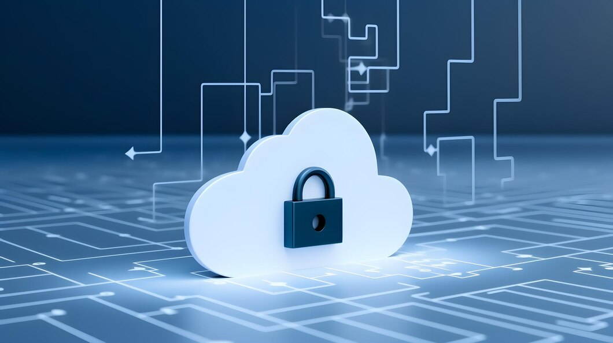

# Hi, I'm [Gazal]! 👋
### Programmer, Cybersecurity Professional, YouTuber 🎥

Welcome to my GitHub profile! I'm passionate about software development, cybersecurity, and sharing my knowledge through YouTube. Below you'll find a list of some of my notable projects and popular YouTube videos.

## 👨‍💻 Software Development Projects:
- [Data Structures and Algorithms Practice (AlgoExpert)](https://www.whizlabs.com/learn/course/aws-solutions-architect-associate/153/lab)
- [Practicing DS & Algos in Python](link)
- [Full Stack Web App (React, NodeJS, Azure, and Machine Learning Components)](link)
- [Image Analysis Middleware (Potentially NSFW)](link)
- [PowerShell](link)
- [Windows EventLog: Failed RDP Logins Source IP to full GeoData Conversion](link)
- [JWipe (Disk Wiping Utility)](link)
- [Active Directory Bulk User Creation](link)
- [FIM (File Integrity Monitor)](link)
- [C# (.NET Desktop Applications)](link)
- [Ransomware Proof of Concept (Encrypter)](link)
- [Ransomware Proof of Concept (Decrypter)](link)
- [Keylogger with Email Capability](link)
- [Python Package Delivery Application (Datastructures and Algorithms Demo)](link)

## 📺 Popular YouTube Videos:
- [How to get into Cybersecurity Starting From Zero](link)
- [A Day in the Life of a Cybersecurity Analyst](link)
- [How to Create a KeyLogger (C#)](link)
- [Ransomware Demonstration (C#)](link)
- [Is WGU Legit?](link)

Feel free to explore my projects and watch my videos to learn more about my work and interests. If you have any questions or want to collaborate, don't hesitate to reach out to me.

Let's connect! 📫
- [YouTube](link-to-your-youtube-channel)
- [LinkedIn](link-to-your-link
